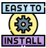

# Customer Dashboard

Ein technisches Referenzprojekt zur Konzeption und Implementierung einer sicheren, CI/CD-basierten Update-Architektur unter restriktiven Infrastrukturbedingungen. Der Fokus dieses Repositoriers liegt nicht auf der funktionalität der Beispielanwendung, sondern auf dem vollständigen Lebenszyklus einer Software. Von der Entwicklung und Build über Release, Installation, Betrieb und autonome, sichere Updates beim Kunden. 

# 🎯 Zielsetzung:

Ziel dieses Projekts ist die Entwicklung eines deterministischen, fehlertoleranten und sicherheitsorientierten Update-Mechanismus, der:

    - reproduzierbare Deployments ermöglicht
    - ausschließlich geprüfte und signierte Artefakte installiert
    - manuelle Eingriffe beim Kunden minimiert
    - Rollbacks im Fehlerfall automatisch durchführt
    
Das Projekt dient nur als Referenzarchitektur für Kundenumgebungen.

Systemüberblick

Das Gesamtsystem besteht aus klar getrennten Komponenten:

        Entwicklung
             ↓
        CI/CD-Pipeline
             ↓
        Signierte Artefakte
             ↓
        Installer
             ↓
        Betrieb beim Kunden
             ↓
        Auto-Update-Daemon

Zentrale Komponenten:

Git-Repository -> Single Source of Truth für App, Installer, Daemon & Pipeline
CI/CD          -> Build, Test, Signierung & Release
Artefakte      -> Docker-Images + signierte ZIP_Pakete
Installer      -> Erstinstallation inkl. System-User & Services
Update-Daemon  -> Autonomer, sicherer Pull-Updater

# 🔐 Sicherheitskonzept

Das Update-System basiert auf einer kryptografischen Vertrauenskette: 

    - SHA-256 Hashprüfung zur Integritätskontrolle
    - Ed25519-Signaturen zur Authentizitätsprüfung
    - Public Key ist fest im Daemon verankert
    - Updates ohne gültige Prüfung werden hart abgelehnt

Außerdem:

    - Atomic Swap beim Update
    - Rollback auf letzte funktionierende Version

# 🔄 Update-Strategie

- Pull basiert

Mehrere Update-Quellen möglich:
    - GitHub Releases/ Nexus etc.
    - Netzwerk-Share
    - Offline-ZIP

Policy-gesteuert:
    - pinnedVersion
    -allowDowngrade

Der Status jedes Update-Laufs wird transparent in einer Statusdatei persistiert.

#   Installation Linux || Windows

cd Deploy
sudo ./install.sh (Linux) || ./install.ps1 (Windows) 

Der Installer: 

    - legt einen dedizierten Service-User an
    - installiert Docker-basierte Anwendung
    - richtet persistente Volumes ein
    - installiert & aktiviert den Update-Daemon als systemd-Service

Standard-Login:

admin@example.com
admin123

# Auto-Update-Daemon

Eigenschaften:

    - läuft systemweit als Hintergrunddienst
    - prüft periodisch auf neue Versionen
    - validiert Hash & Signatur
    - erstellt Backups vor Updates
    - führt Rollback bei Fehlern aus

Der Daemon arbeitet vollständig autonom und benötigt nach der Erstinstallation keinen manuellen Eingriff

